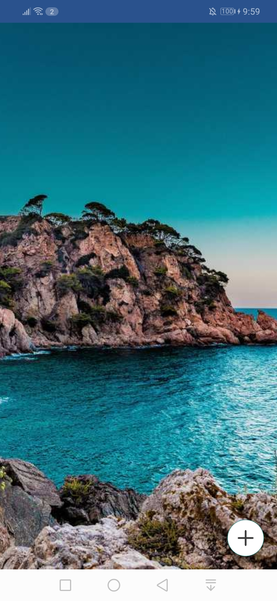

<h1> Pixora </h1>

A wallpaper Android application developed in 2023 for a Fiverr client. This app allows users to browse and download high-quality wallpapers. 

 Note: The source code is not publicly available as this project was sold to a client.

<h2> ⚙️ Technologies </h2>
<ul>
  <li>Java for development.</li>
  <li>UI design with XML.</li>
  <li>Volley & OkHttp for efficient REST API data fetching.</li>
  <li>Glide & Picasso for image loading and caching.</li>
</ul>

<h2> 🔥 Features </h2>
<ul>
  <li>Browse and download wallpapers.</li>
  <li>Categorized wallpapers for easy browsing.</li>
  <li>Set wallpapers as home/lock screen.</li>
  <li>Share wallpapers,</li>
</ul>
  
<h2> 📸 Screenshots </h2>

 

 

To see all screenshots, check the "ss" folder.

<h2> 👽 Author </h2>
<a href="https://www.imashasenarath.com/" target="_blank"><strong>Imasha Senarath</strong></a>

<h2> © Credits </h2>

All icons, images, and other media used in this project are the property of their respective copyright owners. Their rights are fully acknowledged and respected.
